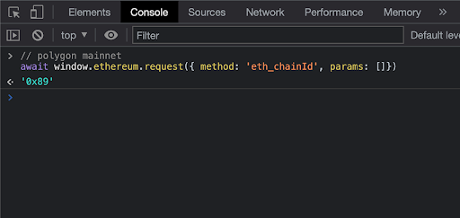

# Introduction to the MetaMask dApp API

If you are planning to integrate identity and transactions into your Web3 applications, getting acclimated with the MetaMask API is a great way to start learning the capabilities afforded to you working with the MetaMask Extension and learning your way around the Web3 stack in general.

## TOC

[What is the MetaMask API?](#what-is-the-metamask-api)  
[What is JSON RPC?](#what-is-json-rpc)  
[Essential Tools](#essential-tools)  
[MetaMask Documentation](#metamask-documentation)  
[MetaMask API Playground](#metamask-api-playground)  
[Examples of Usage](#examples-of-usage)  
[RPC](#rpc)  
[Smart Contracts](#smart-contracts)  

## What is the MetaMask API?

Whenever we use a browser like Chrome, Firefox, or Brave and a wallet extension like MetaMask installed, we can use the Ethereum provider (as specified by EIP-1193) injected into the browser page at `window.ethereum`.

We use this provider with our dapp to request users’ Ethereum accounts, read on-chain data and have the user sign messages and transactions.

[Should we have a link to a docs page that describes what happens when multiple wallets are installed?]

We can tell in the developer tools when MetaMask is installed and enabled through the developer tools, using chrome you can look into the Sources/Page, and you will see an icon that represents MetaMask.

Page is used for viewing available resources on the current webpage. 
Under the Top level, we see the representation of the main document and all of its resources.

If we see MetaMask represented by a cloud icon here, we know that the MetaMask is installed and not disabled.

The `window.ethereum` object is being injected into the page, allowing us to interact with MetaMask and Ethereum.

We can directly access and call the `window.ethereum` object in our developer tools console. Let’s say that we wanted to get the current chainId…

By running the code above in our console, and if we are currently connected to Polygon, we would see ‘0x89’ returned from this method call.

If you’re interested in knowing the various chainIds you can use something like [chainlist](https://chainlist.org) or an online tool like [eserialize](https://eserialize.com/) to convert that hex to a number.

To do the same thing within your code, you might want to rely on ethers [hexlify](https://docs.ethers.io/v4/api-utils.html) or roll your own solution and create a method that utilizes parseInt from javaScript.

As you get started with using MetaMask API methods, you might want to check out some of our [beginner-level videos](https://www.youtube.com/watch?v=03lbmYrawV8) from our Lead DX Engineer Gui Bibeau that can help get you started working with the MetaMask API.

## What is JSON RPC?

JSON-RPC is a transport agnostic RPC that uses the JSON data format. When communicating with a JSON-RPC server you’re sending light-weight JSON despite how that server was built or with what language or platform is was built on. It's designed to be simple and is relatively simple to learn with the right tools.

This is convenient as it means no matter if we send over HTTP or Web Sockets, we are always sending JSON which is approachable to all developers.

JSON RPC IMHO, is a really important technology to learn about when first getting into Web3 and learning to build on the Dapp layer, a few other technologies I think you should be familiar with are:

- [JavaScript](https://www.udemy.com/courses/search/?src=ukw&q=javascript) and [TypeScript](https://www.typescriptlang.org/docs/handbook/typescript-from-scratch.html)
- having a good understanding of existing Web2 concepts
- Smart Contracts ([Solidity](https://docs.soliditylang.org/))

